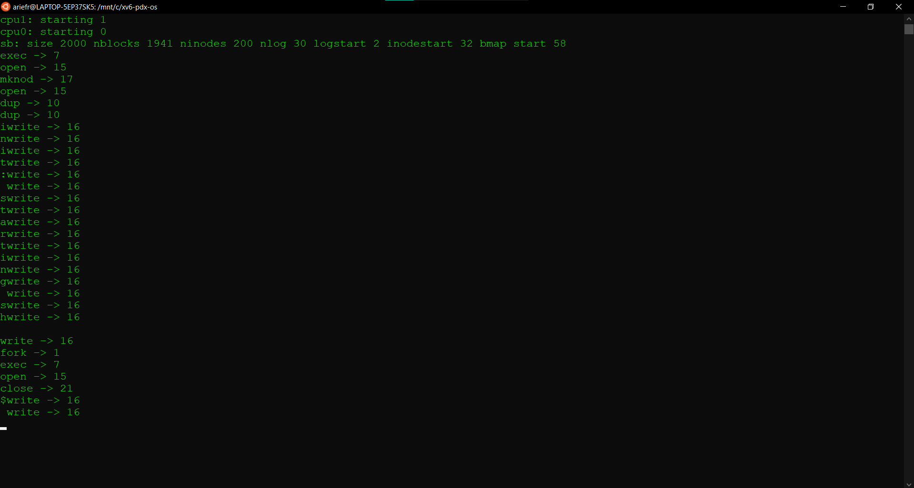

##Pada halaman ini terdapat bukti dari program yang sudah berhasil dijalankan

### - Compilation Test

### - Date System Call

### - Process Information

### - Conditional Compilation

.png)

.png)

.png)

.png)

### - System Call Tracing

